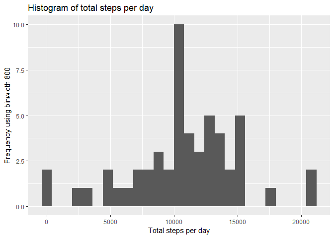
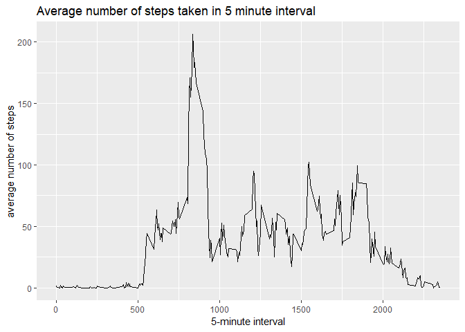
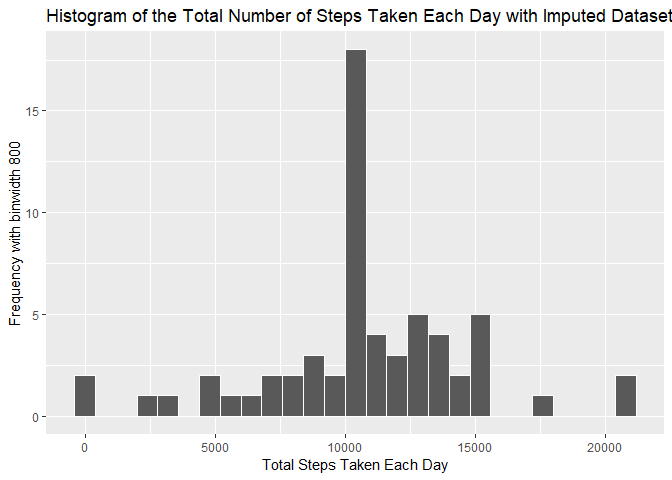
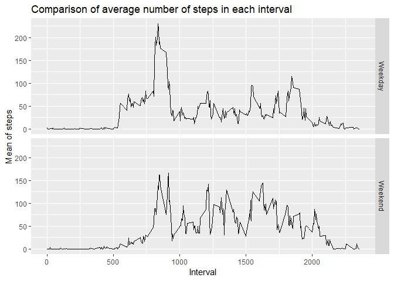

## Loading and preprocessing the data
##### Load the data (i.e. read.csv())

```r
if(!file.exists('activity.csv')){
    unzip('activity.zip')
}
activitydata <- read.csv('activity.csv')
```

## What is mean total number of steps taken per day?

##### 1. Processing the data to find total steps taken in a day

```r
newdata <- aggregate(activitydata$steps, by = list(Date = activitydata$date), FUN=sum)
names(newdata)[names(newdata) == "x"] <- "Total_Steps"
temp <- as.Date(newdata$Date, "%Y-%m-%d")
newdata$Date <- format(temp, format = "%m-%d")
```

##### 2. Ploting a histogram of total steps taken per day

```r
ggplot(data = na.omit(newdata), aes(Total_Steps))+
  geom_histogram(binwidth = 800) + xlab("Total steps per day")+ ylab("Frequency using binwidth 800")+
  ggtitle("Histogram of total steps per day")
```

<!-- -->

##### 3. Report mean and median number of steps taken per day

```r
meansteps <- mean(na.omit(newdata$Total_Steps))
mediansteps <- median(na.omit(newdata$Total_Steps))
```

* Mean: 1.0766189\times 10^{4}
* Median:  10765

## What is the average daily activity pattern?

```r
stepspertimeblock <- aggregate(steps ~ interval, data = activitydata, FUN = mean)
```

##### 1. Make a time series plot

```r
ggplot(stepspertimeblock, aes(interval, steps))+geom_line()+xlab("5-minute interval")+
ylab("average number of steps")+ggtitle("Average number of steps taken in 5 minute interval")
```

<!-- -->

##### 2. Which 5-minute interval, on average across all the days, contains the maximum number of steps?

```r
stepspertimeblock[which(stepspertimeblock$steps== max(stepspertimeblock$steps)), ]
```

```
##     interval    steps
## 104      835 206.1698
```

## Imputing missing values
##### 1. Calculate and report the total number of missing values in the dataset 

```r
sapply(X= activitydata, FUN = function(x) sum(is.na(x)))
```

```
##    steps     date interval 
##     2304        0        0
```

##### 2. Devise a strategy for filling in all of the missing values in the dataset with mean
##### 3. Create a new dataset that is equal to the original dataset but with the missing data filled in.

```r
replace_with_mean <- function(y) replace(y, is.na(y), mean(y, na.rm = T))
impdata <- (activitydata %>% group_by(interval)) %>% mutate(steps = replace_with_mean(steps))
sum(is.na(impdata))
```

```
## [1] 0
```

```r
impute_data <- as.data.frame(impdata)
```

##### 4. Make a histogram of the total number of steps taken each day 

```r
data_steps <- aggregate(impute_data$steps, by = list(Date = impute_data$date), FUN=sum)
names(data_steps)[names(data_steps) == "x"] <- "Total"
hist2 <- ggplot(data = data_steps, aes(Total)) + 
  geom_histogram(binwidth = 800, colour = "white") +
  xlab("Total Steps Taken Each Day") +
  ylab("Frequency with binwidth 800") +
  ggtitle("Histogram of the Total Number of Steps Taken Each Day with Imputed Dataset")
print(hist2)
```

<!-- -->

## Are there differences in activity patterns between weekdays and weekends?
##### 1. Create a new factor variable in the dataset with two levels – “weekday” and “weekend” indicating whether a given date is a weekday or weekend day.

```r
impute_data$WeekendorWeekday <- ifelse(weekdays(as.Date(impute_data$date)) %in% c("Monday","Tuesday", "Wednesday", "Thursday", "Friday"),"Weekday", "Weekend")
```

##### 2. Make a panel plot containing a time series plot

```r
impute_data <- (impute_data %>% group_by(interval, WeekendorWeekday) %>% summarize(Mean=mean(steps)))
ggplot(data = impute_data, aes(x=interval, y=Mean))+ geom_line()+ facet_grid(WeekendorWeekday ~ .)+
  xlab("Interval")+ylab("Mean of steps")+ggtitle("Comparison of average number of steps in each interval")
```

<!-- -->

